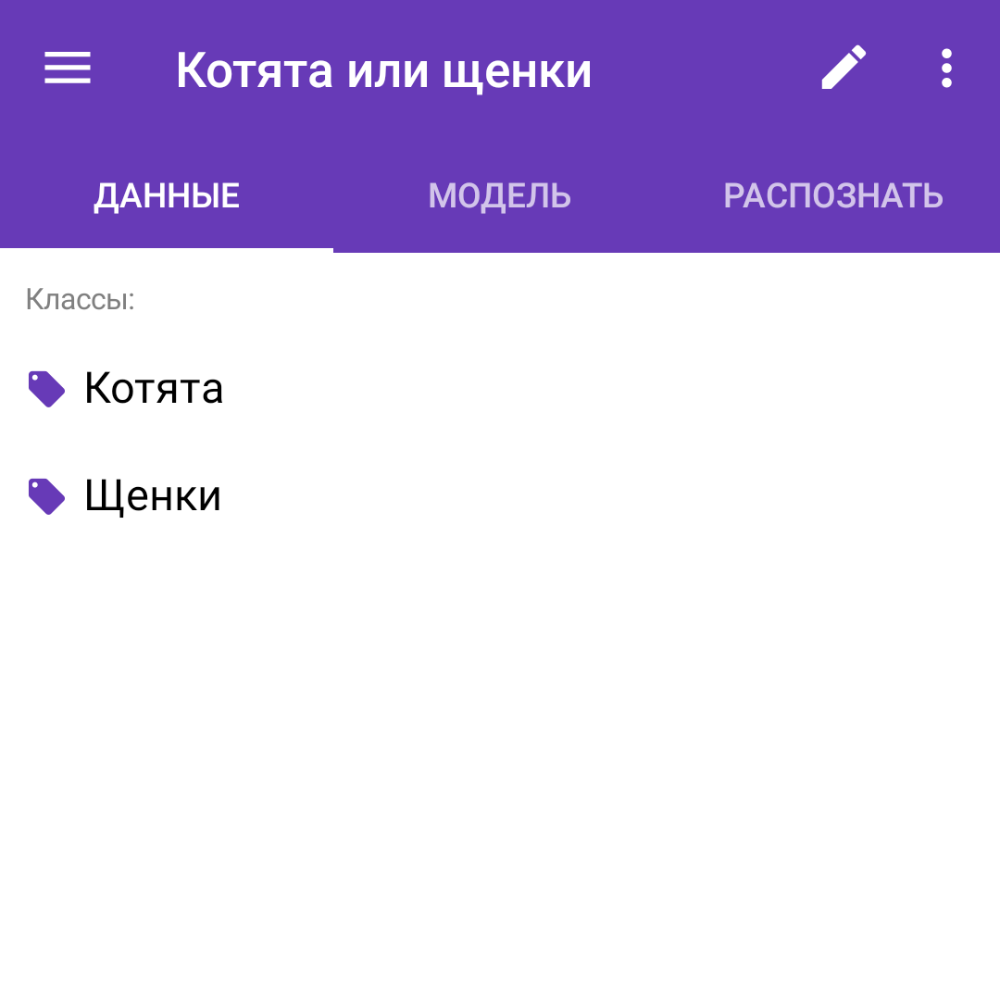
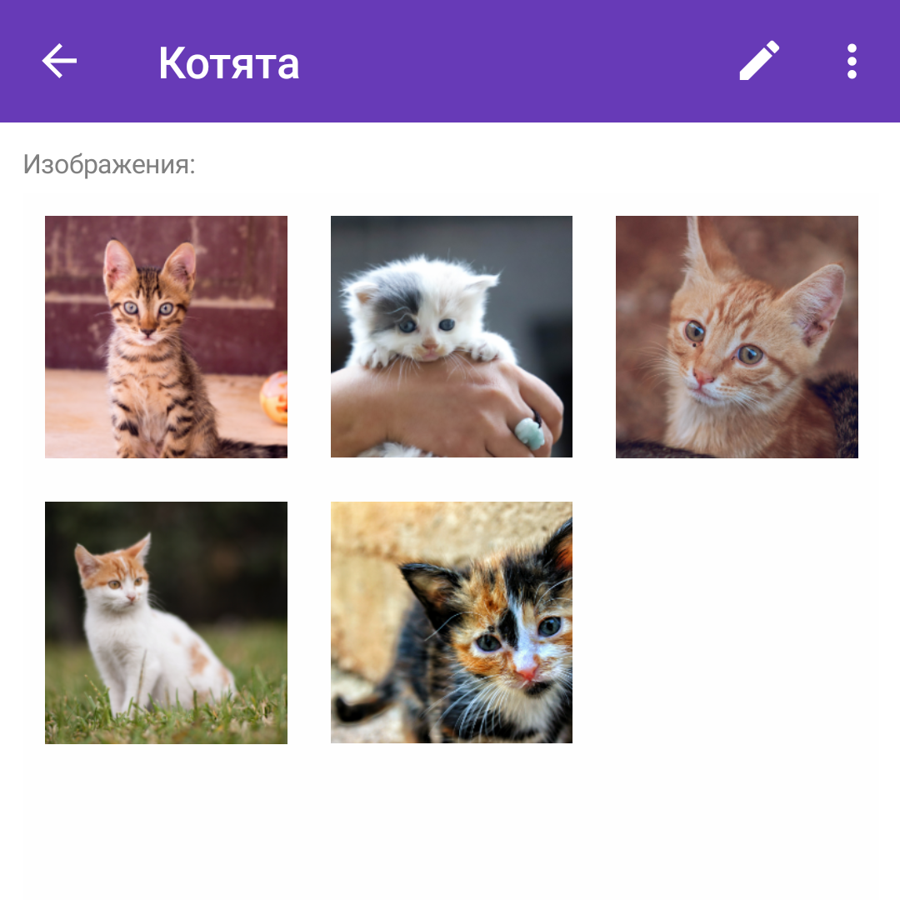
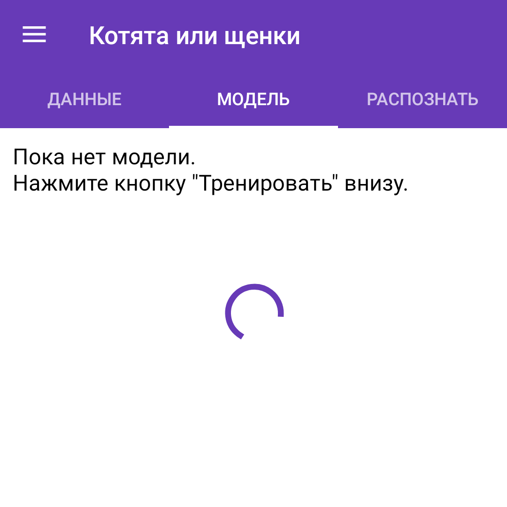
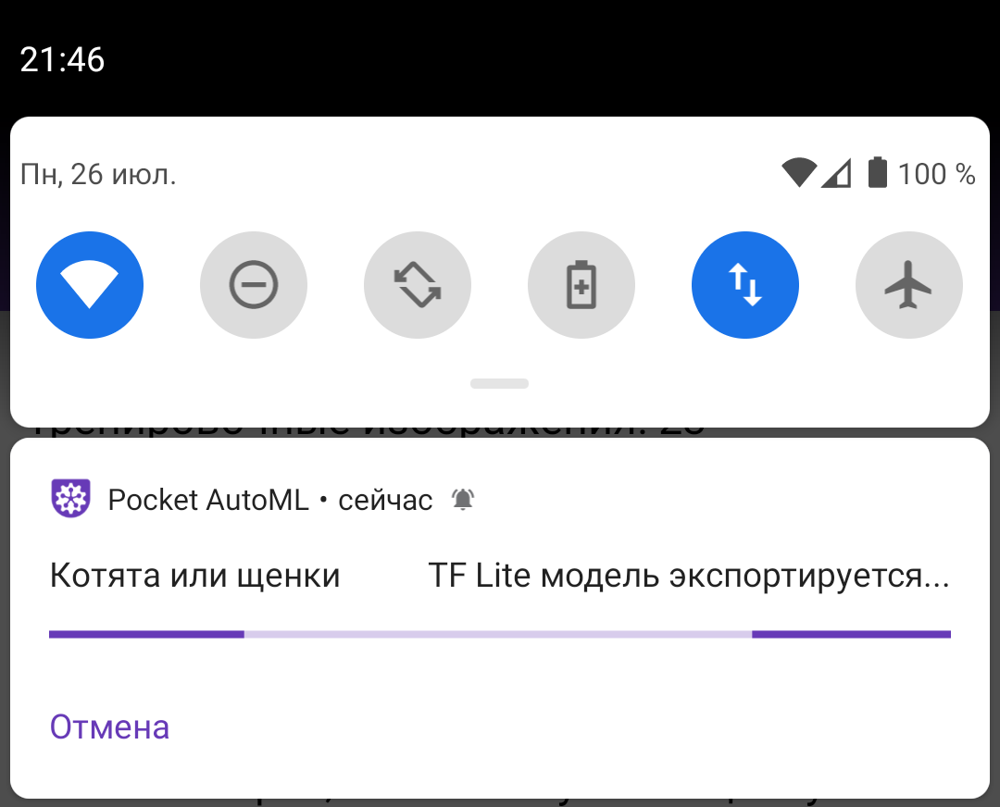
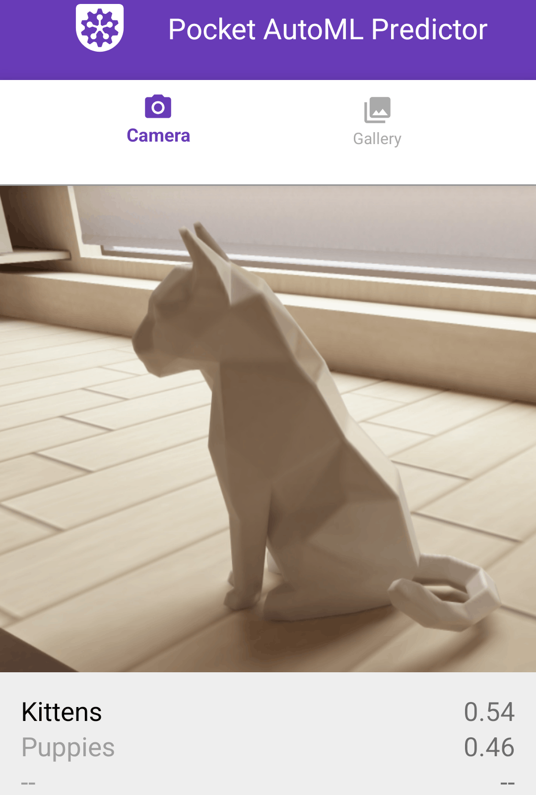

# Pocket AutoML: руководство по созданию Android приложения для классификации изображений с помощью deep learning

## Переводы

* [English](README.md) 
* [Русский](README_ru.md) (этот документ)

## Обзор

Этот документ содержит шаги, следуя которым Вы создадите Ваше Android приложение, которое будет использовать deep learning модель классификации изображений, натренированную Вами в [Pocket AutoML](https://play.google.com/store/apps/details?id=com.evgeniymamchenko.pocketautoml) и экспортированную в формате TensorFlow Lite (`.tflite`). Приложение будет непрерывно классифицировать изображения с тыловой камеры устройства.

Это руководство основано на [примере классификации изображений Google AI Edge LiteRT для Android](https://github.com/google-ai-edge/litert-samples/tree/main/compiled_model_api/image_classification).

> **Примечание:** Приложение было модернизировано в 2026 году — теперь оно написано на **Kotlin** и использует [**LiteRT**](https://ai.google.dev/edge/litert) (API `CompiledModel`) для инференса, [CameraX](https://developer.android.com/training/camerax) для камеры и современную сборку Gradle/AGP. Предыдущая версия (Java, Camera2 и устаревшая TensorFlow Lite Task Library) сохранена в теге [`pre-modernization`](https://github.com/OutSorcerer/pocket-automl-android-tutorial/tree/pre-modernization).

> Если у Вас возникли трудности при следовании этому руководству, напишите мне (создателю Pocket AutoML) на [электронную почту](mailto:pocket-automl@evgeniymamchenko.com) или создайте [issue](https://github.com/OutSorcerer/pocket-automl-android-tutorial/issues) на GitHub.

## Требования

* [Android Studio](https://developer.android.com/studio) Panda 4 (2025.3.4) или новее (установленная на машине под Linux, Mac или Windows)

* [если не используется эмулятор Android] Android устройство в [режиме разрабочика](https://developer.android.com/studio/debug/dev-options) с включенной отладкой по USB и USB кабель (чтобы подключить Android устройство к вашей машине)

## Шаг 1. Натренируйте модель в Pocket AutoML

* [Установите Pocket AutoML в Google Play Store](https://play.google.com/store/apps/details?id=com.evgeniymamchenko.pocketautoml) и запустите его

* Создайте задачу, например `Котята или щенки`, нажав кнопку `+`

* Создайте класс, например `Котята`
  
  

* Добавьте примеры изображений класса, сделав фото или выбрав их на хранилище Вашего устройства.
  
  

* Вернитесь на страницу задачи, нажав `<-` и повторите шаги выше для каждого класса

* Вернитесь на страницу задачи, нажав `<-`, перейдите на вкладку `МОДЕЛЬ` и нажмите `ТРЕНИРОВАТЬ`

  

## Шаг 2. Экспортируйте модель в формате TF Lite из Pocket AutoML

* Нажмите `ЭКСПОРТИРОВАТЬ В ФОРМАТЕ TF LITE`

* Модель скачивается в папку `Downloads` (Загрузки) Вашего устройства системным менеджером загрузок. Проведите вниз от верхнего края экрана, чтобы следить за прогрессом загрузки в панели уведомлений. Процесс экспорта занимает несколько минут.

  

* Когда загрузка завершена, откройте папку `Downloads` (Загрузки), например, с помощью приложения `Files` (`Файлы`), найдите файл `<имя_вашей_задачи>.tflite` и перенесите его на Ваш ПК — например, отправив себе через клиент электронной почты вроде GMail или загрузив в облачное хранилище вроде Яндекс Диска или Dropbox.


## Шаг 3. Клонируйте репозиторий с кодом примера 

Выполните следующую команду, чтобы получить демо приложение.

```
git clone https://github.com/OutSorcerer/pocket-automl-android-tutorial
```

Откройте код примера в Android Studio. Для этого сперва запустите Android Studio,
выберите `Open an existing project`, затем выберите папку `pocket-automl-android-tutorial`.

Приложение выполняет инференс с помощью [API `CompiledModel` из LiteRT](https://ai.google.dev/edge/litert). На GPU принудительно используется полная точность **FP32** (`GpuOptions` из LiteRT) — именно это позволяет модели Pocket AutoML на базе EfficientNet работать на GPU без появления NaN в результатах. Названия классов и параметры нормализации входных данных (mean/std) читаются прямо из метаданных, встроенных в `.tflite` модель, поэтому отдельный файл с метками во время работы не нужен (см. Шаг 6).

## Шаг 4. Постройте проект в Android Studio

Выберите `Build -> Assemble Project` (также можно нажать на значок молотка 🔨 на панели инструментов или клавиши `Ctrl+F9` / `Cmd+F9`) и убедитесь, что проект успешно строится. 
Android Studio предложит скачать отсутствующие компоненты (например, Android SDK и инструменты сборки).

## Шаг 5. Установите и запустите приложение

>Выполните этот шаг, чтобы убедиться, что пример успешно работает в вашей среде со стандартными моделями. 
Следующий шаг продемонстрирует, как добавить в пример Вашу модель, натренированную в Pocket AutoML.

### Запуск на устройстве

Если Вы хотите тестировать приложение на настоящем Anroid устройстве, подключите устройство к компьютеру и одобрите все разрешения на отладку, которые появляются на экране Вашего устройства.
Выберите Ваше устройство в выпадающем списке целевых устройств вверху Android Studio (подключённые устройства также отображаются в `Device Manager`).
Затем нажмите `Run -> Run 'app'` в главном меню Android Studio, чтобы собрать и установить приложение на выбранное устройство.

### Запуск на эмуляторе

Если Вы хотите тестировать приложение на Android эмуляторе 
* откройте `Tools -> Device Manager` и нажмите `+ -> Create Virtual Device`
* выберите тип устройства, например `Medium Phone` (это управляет его разрешением экрана и плотностью пикселей) и нажмите `Next`
* выберите уровень API — рекомендуется `Android 16 (API level 36)` или новее, чтобы соответствовать target SDK приложения (приложению требуется API level 24 или выше)
* выберите образ системы, предпочтительно отмеченный звёздочкой, который рекомендуется для вашей системы
* нажмите `Finish`
* выберите только что созданное устройство в `Device Manager` и нажмите `Run -> Run 'app'` в главном меню Android Studio

Если Вы хотите узнать больше, см. [Create and manage virtual devices](https://developer.android.com/studio/run/managing-avds#createavd) в документации Android.

Чтобы протестировать приложение, откройте приложение под названием `Pocket AutoML Predictor` на Вашем устройстве или эмуляторе.
Когда Вы запускаете приложение впервые, оно запросит доступ к камере.
Переустановка приложения может потребовать удаление предыдущих его установок.

## Шаг 6. Добавьте Вашу модель из Pocket AutoML в пример

* На данный момент у Вас должен быть файл модели `<имя_вашей_задачи>.tflite`, экспортированный из Pocket AutoML. Названия классов встроены в метаданные модели — их напрямую читает библиотека LiteRT Metadata во время работы, так что больше ничего готовить не нужно.

* Скопируйте `<имя_вашей_задачи>.tflite` в папку `pocket-automl-android-tutorial/app/src/main/assets`

* Откройте `ImageClassifierHelper.kt` (нажав `Navigate -> Search Everywhere` или нажав `Shift` дважды и напечатав его название) и в методе `setupImageClassifier()` укажите Ваш файл в ветке `MODEL_POCKET_AUTOML` блока `when (currentModel)`: `MODEL_POCKET_AUTOML -> "<имя_вашей_задачи>.tflite"`

* Запустите приложение. Модель Pocket AutoML выбрана по умолчанию; Вы также можете провести вверх от низа экрана и выбрать её из выпадающего меню `ML Model`.

* Вы увидите предсказанный класс и соответствующую ему вероятность, а ниже — вероятности других классов. Отличная работа!

  

## Следующие шаги

### Применения

Есть ли у Вас на примете задача, которая может быть решена с помощью модели классификации изображений в мобильном приложении? Это может быть сортировка деталей Lego или управление роботом с помощью жестов.

Я буду рад узнать, что вы создали с помощью Pocket AutoML и этого руководства, и добавлю в этот документ ссылки на Play Store или GitHub.

### Другие платформы

TF Lite может работать не только на Anroid но и на других платформах включая [iOS](https://www.tensorflow.org/lite/guide/ios), [встроенные Linux устройства вроде Raspberry Pi или Coral](https://www.tensorflow.org/lite/guide/python) и [микроконтроллеры](https://www.tensorflow.org/lite/microcontrollers).

### Другие способы тренировки моделей

Вы можете попробовать другие no-code или low-code deep learning решения вроде [Teachable Machine](https://teachablemachine.withgoogle.com/), [Roboflow](https://roboflow.com/), [Create ML](https://developer.apple.com/machine-learning/create-ml/), [Google Cloud AutoML](https://docs.cloud.google.com/gemini-enterprise-agent-platform/machine-learning/training/automl-training-overview), [Azure Custom Vision](https://azure.microsoft.com/en-us/products/ai-services/ai-custom-vision), [LandingLens](https://landing.ai/landinglens), [Edge Impulse](https://edgeimpulse.com/) или [MediaPipe Model Maker](https://ai.google.dev/edge/mediapipe/solutions/model_maker).

Pocket AutoML использует подход [transfer learning](https://www.coursera.org/lecture/convolutional-neural-networks/transfer-learning-4THzO), Вы можете сами реализовать его используя руководство [Transfer learning and fine-tuning](https://colab.research.google.com/github/tensorflow/docs/blob/master/site/en/tutorials/images/transfer_learning.ipynb) в Google Colab.

### Изучение глубокого обучения

Если Вы хотите узнать, как лучше тренировать модели и иметь систематическое понимание глубокого обучения я рекомендую [Deep Learning Specialization](https://www.coursera.org/specializations/deep-learning) и [Machine Learning Engineering for Production (MLOps) Specialization](https://www.coursera.org/specializations/machine-learning-engineering-for-production-mlops) на Coursera.

## Attribution statements

MediaPipe, TensorFlow, the TensorFlow logo and any related marks are trademarks of Google Inc. Android is a trademark of Google LLC.

## Лицензия

[Apache License 2.0](LICENSE)
