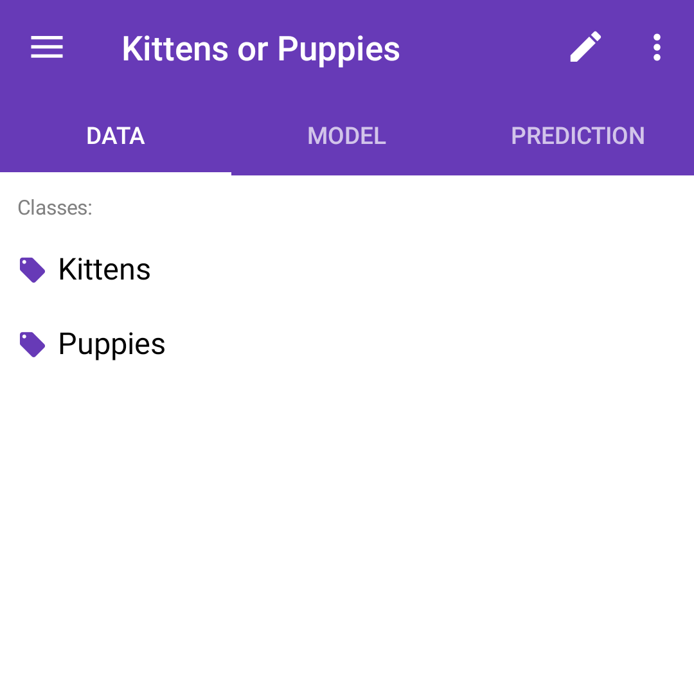
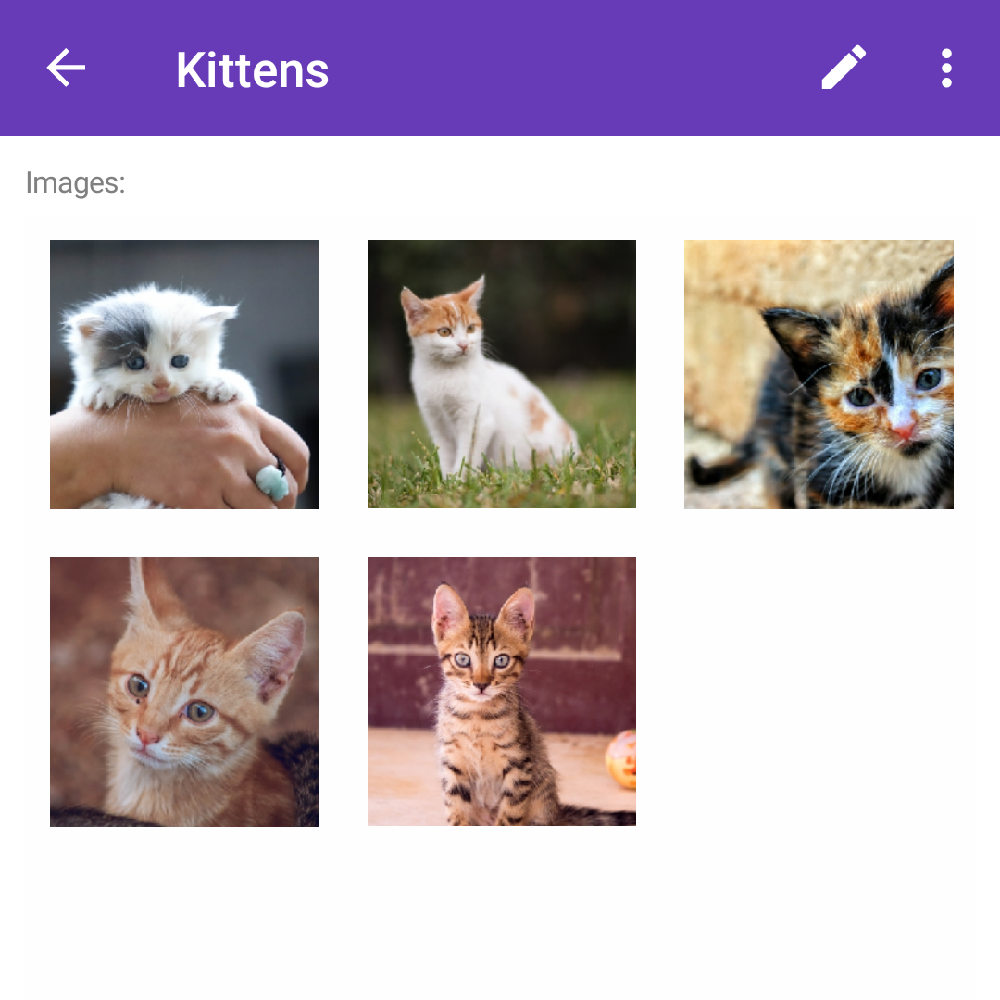
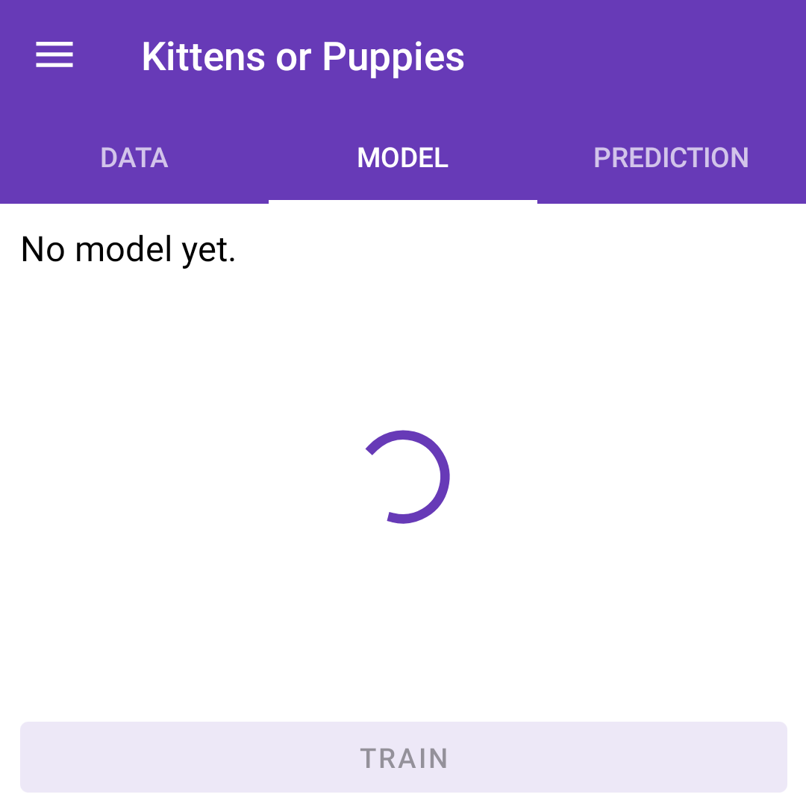
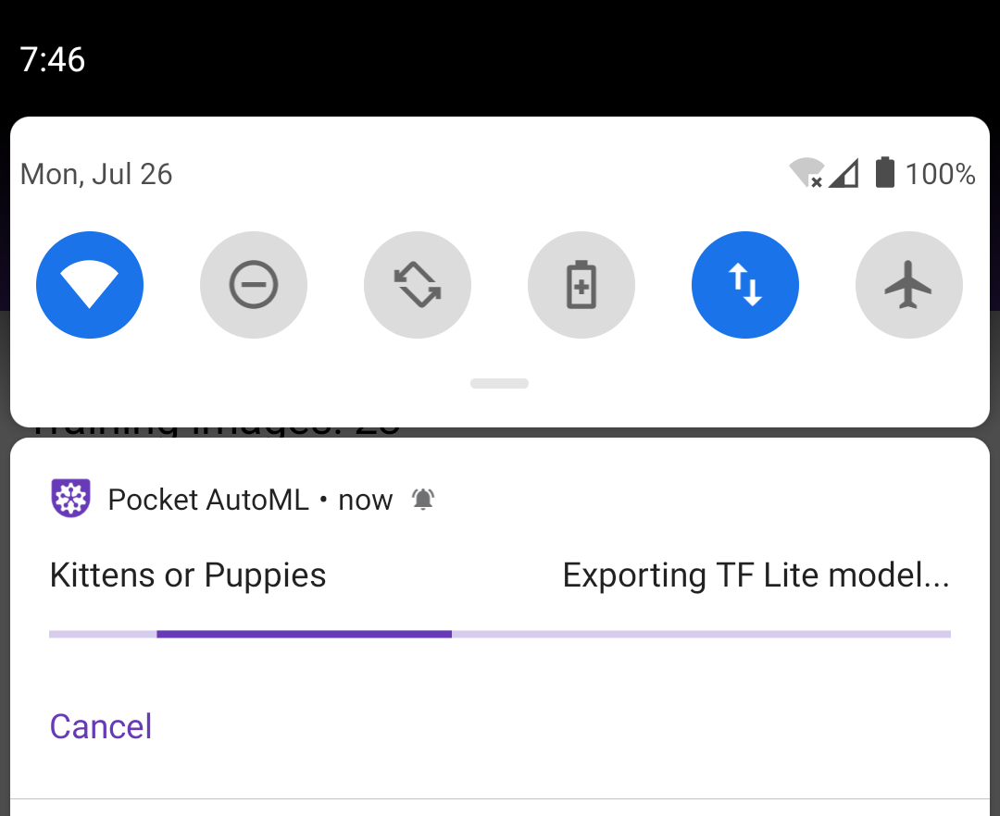

# Pocket AutoML：使用深度学习创建 Android 图像分类应用教程

## 翻译

* [English](README.md)
* [Русский](README_ru.md)
* [简体中文](README_zh-CN.md)（本文档）

## 概述

本文档将引导您逐步创建自己的 Android 应用。该应用运行一个在 [Pocket AutoML](https://play.google.com/store/apps/details?id=com.evgeniymamchenko.pocketautoml) 中训练、并以 LiteRT（前身为 TensorFlow Lite）`.tflite` 格式导出的深度学习图像分类模型。应用会持续对设备后置摄像头拍摄到的画面进行分类。

本教程基于 [Google AI Edge LiteRT 图像分类 Android 示例](https://github.com/google-ai-edge/litert-samples/tree/main/compiled_model_api/image_classification)。

> **注意：** 本应用已于 2026 年现代化改造——现在使用 **Kotlin** 编写，并使用 [**LiteRT**](https://ai.google.dev/edge/litert)（前身为 TensorFlow Lite；`CompiledModel` API）进行推理，使用 [CameraX](https://developer.android.com/training/camerax) 操作相机，并采用最新的 Gradle/AGP 构建方式。旧版本（Java、Camera2 以及已过时的 TensorFlow Lite Task Library）保留在 [`pre-modernization`](https://github.com/OutSorcerer/pocket-automl-android-tutorial/tree/pre-modernization) 标签中。

> 如果您在学习本教程时遇到任何问题，请通过[电子邮件](mailto:pocket-automl@evgeniymamchenko.com)联系我（Pocket AutoML 的作者），或在 GitHub 上创建 [issue](https://github.com/OutSorcerer/pocket-automl-android-tutorial/issues)。

## 环境要求

* [Android Studio](https://developer.android.com/studio) Panda 4（2025.3.4）或更新版本（安装在 Linux、Mac 或 Windows 机器上）

* [如果不使用 Android 模拟器] 一台已开启[开发者模式](https://developer.android.com/studio/debug/dev-options)并启用 USB 调试的 Android 设备，以及一根 USB 数据线（用于将 Android 设备连接到电脑）

## 第 1 步：在 Pocket AutoML 中训练模型

* [从 Google Play 商店安装 Pocket AutoML](https://play.google.com/store/apps/details?id=com.evgeniymamchenko.pocketautoml) 并打开它

* 点击 `+` 按钮创建一个任务，例如 `Kittens or Puppies`（小猫还是小狗）

* 创建一个类别，例如 `Kittens`（小猫）
  
  

* 通过用相机拍照或从存储中选取图片，为该类别添加示例图像
  
  

* 点击 `<-` 返回任务页面，并为每个类别重复以上步骤

* 点击 `<-` 返回任务页面，切换到 `MODEL`（模型）标签页并点击 `TRAIN`（训练）

  

## 第 2 步：从 Pocket AutoML 以 TF Lite 格式导出模型

* 点击 `EXPORT IN TENSORFLOW LITE FORMAT`（以 TensorFlow Lite 格式导出）

* 模型会由系统下载管理器下载到设备的 `Downloads`（下载）文件夹。从屏幕顶部向下滑动，即可在通知栏中查看下载进度。导出过程需要几分钟。

  

* 下载完成后，打开 `Downloads`（下载）文件夹（例如使用 `Files`（文件）应用），找到 `<你的任务名>.tflite`，并将其传输到您的电脑上——例如通过 GMail 等电子邮件应用发送给自己，或上传到 Google Drive、Dropbox 等云存储。

## 第 3 步：克隆 Pocket AutoML 示例源代码

运行以下命令获取示例应用。

```
git clone https://github.com/OutSorcerer/pocket-automl-android-tutorial
```

在 Android Studio 中打开示例源代码。为此，请打开 Android Studio，选择 `Open an existing project`（打开现有项目），并将文件夹设置为 `pocket-automl-android-tutorial`。

本应用使用 [LiteRT `CompiledModel` API](https://ai.google.dev/edge/litert) 进行推理。在 GPU 上它会强制使用完整的 **FP32** 精度（LiteRT 的 `GpuOptions`），正是这一点使得基于 EfficientNet 的 Pocket AutoML 模型能够在 GPU 上运行而不会产生 NaN 分数。类别标签和输入归一化参数（mean/std）直接从 `.tflite` 模型内嵌的元数据中读取，因此运行时无需管理单独的标签文件（参见第 6 步）。

## 第 4 步：构建 Android Studio 项目

选择 `Build -> Assemble Project`（也可以点击工具栏中的锤子 🔨 图标，或按 `Ctrl+F9` / `Cmd+F9`），确认项目构建成功。
Android Studio 会提示您下载缺失的组件（例如 Android SDK 和构建工具）。

## 第 5 步：安装并运行应用

>请先完成这一步，确认示例应用能使用其内置模型在您的环境中成功运行。下一步将演示如何把您在 Pocket AutoML 中训练的自定义模型添加到示例应用中。

### 在真机上运行

如果您想在 Android 真机上测试应用，请将设备连接到电脑，并批准手机上弹出的所有 ADB 权限请求。在 Android Studio 顶部的目标设备下拉列表中选择您的设备（已连接的设备也会显示在 `Device Manager`（设备管理器）中）。然后在 Android Studio 主菜单中点击 `Run -> Run 'app'`，即可在所选设备上构建并安装应用。

### 在模拟器上运行

如果您想在 Android 模拟器上测试应用
* 打开 `Tools -> Device Manager`，点击 `+ -> Create Virtual Device`
* 选择一个设备定义，例如 `Medium Phone`（这决定了屏幕分辨率和像素密度），然后点击 `Next`
* 选择 API 级别——推荐 `Android 16 (API level 36)` 或更新版本，以匹配应用的 target SDK（应用要求 API level 24 或更高）
* 选择一个系统镜像，最好选择标有星标的、系统推荐的镜像
* 点击 `Finish`
* 在 `Device Manager` 中选择刚创建的设备，然后在 Android Studio 主菜单中点击 `Run -> Run 'app'`

如果您想了解更多，请参阅 Android 文档中的 [Create and manage virtual devices](https://developer.android.com/studio/run/managing-avds#createavd)（创建和管理虚拟设备）。

要测试应用，请在您的设备或模拟器上打开名为 `Pocket AutoML Predictor` 的应用。
首次运行时，应用会请求相机访问权限。
重新安装应用时，可能需要先卸载之前的安装。

## 第 6 步：将您在 Pocket AutoML 中训练的模型添加到示例应用中

* 此时您应该已经拥有从 Pocket AutoML 导出的 `<你的任务名>.tflite` 模型文件。类别标签已嵌入模型的元数据中，LiteRT Metadata 库会在运行时直接读取它们——无需再准备其他任何东西。

* 将 `<你的任务名>.tflite` 复制到 `pocket-automl-android-tutorial/app/src/main/assets` 目录中

* 打开 `ImageClassifierHelper.kt`（点击 `Navigate -> Search Everywhere`，或连按两次 `Shift` 并输入文件名），在 `setupImageClassifier()` 中，将 `when (currentModel)` 代码块的 `MODEL_POCKET_AUTOML` 分支指向您的文件：`MODEL_POCKET_AUTOML -> "<你的任务名>.tflite"`

* 运行应用。Pocket AutoML 模型默认已被选中；您也可以向上滑动底部面板，从 `ML Model`（机器学习模型）下拉菜单中选择它。

* 您将看到预测出的类别及其概率，其他类别的概率显示在下方。干得漂亮！

  

## 后续步骤

### 实际应用

您手头是否有可以借助移动应用中的图像分类模型来解决的任务？比如分拣乐高积木，或用手势控制机器人。

我很期待了解您借助 Pocket AutoML 和本教程构建了什么，并会将相关的 Play Store 或 GitHub 链接添加到本文档中。

### 其他平台

TF Lite 不仅可以在 Android 上运行，还支持其他平台，包括 [iOS](https://www.tensorflow.org/lite/guide/ios)、[Raspberry Pi 或 Coral 等嵌入式 Linux 设备](https://www.tensorflow.org/lite/guide/python)以及[微控制器](https://www.tensorflow.org/lite/microcontrollers)。

### 其他模型训练方法

您可以尝试其他无代码或低代码深度学习解决方案，例如 [Teachable Machine](https://teachablemachine.withgoogle.com/)、[Roboflow](https://roboflow.com/)、[Create ML](https://developer.apple.com/machine-learning/create-ml/)、[Google Cloud AutoML](https://docs.cloud.google.com/gemini-enterprise-agent-platform/machine-learning/training/automl-training-overview)、[Azure Custom Vision](https://azure.microsoft.com/en-us/products/ai-services/ai-custom-vision)、[LandingLens](https://landing.ai/landinglens)、[Edge Impulse](https://edgeimpulse.com/) 或 [MediaPipe Model Maker](https://ai.google.dev/edge/mediapipe/solutions/model_maker)。

Pocket AutoML 使用[迁移学习（transfer learning）](https://www.coursera.org/lecture/convolutional-neural-networks/transfer-learning-4THzO)方法，您也可以参照 Google Colab 中的教程 [Transfer learning and fine-tuning](https://colab.research.google.com/github/tensorflow/docs/blob/master/site/en/tutorials/images/transfer_learning.ipynb)（迁移学习与微调）自己实现它。

### 学习深度学习

如果您想学习如何训练更好的模型，并系统地理解深度学习，我推荐 Coursera 上的 [Deep Learning Specialization](https://www.coursera.org/specializations/deep-learning)（深度学习专项课程）和 [Machine Learning Engineering for Production (MLOps) Specialization](https://www.coursera.org/specializations/machine-learning-engineering-for-production-mlops)（面向生产的机器学习工程（MLOps）专项课程）。

## 许可证

[Apache License 2.0](LICENSE)
